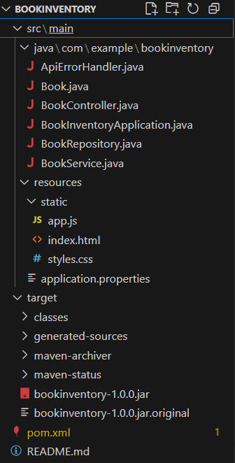
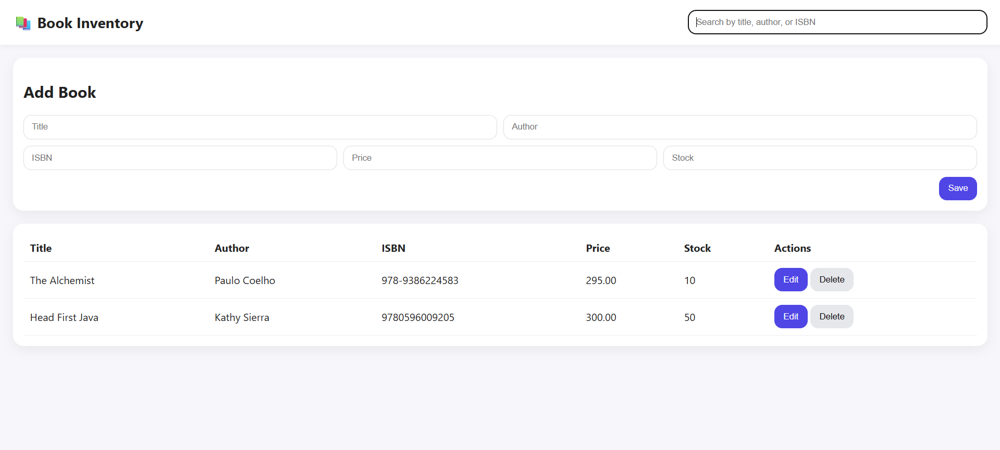

Book Management System 

## 👨‍💻 Author (Group Project)

1.Snigdha Kandikatla
2.Pranjali Sidral

A simple Book Management web application built with:

- **Backend:** Spring Boot (REST API)
- **Database:** PostgreSQL
- **Frontend:** Vanilla JavaScript (HTML/CSS/JS)

## Features
- Add new books with ISBN, title, author, and price.
- View all books.
- Delete books by ID/ISBN.
- Uses REST APIs and fetch calls from Vanilla JS.

## Project Structure

 

 
## How to Run

1. **Setup PostgreSQL:**
   ```sql
   CREATE DATABASE bookdb;
   CREATE USER bookuser WITH ENCRYPTED PASSWORD 'bookpass';
   GRANT ALL PRIVILEGES ON DATABASE bookdb TO bookuser;


2. **Configure application.properties:**
spring.datasource.url=jdbc:postgresql://localhost:5432/bookdb
spring.datasource.username=bookuser
spring.datasource.password=bookpass
spring.jpa.hibernate.ddl-auto=update


3. **Run the backend:**

 mvn spring-boot:run


4. **Access API endpoints:**

- `GET /api/books` – List all books  
- `POST /api/books` – Add a book  
- `PUT /api/books/{id}` – Update  
- `DELETE /api/books/{id}` – Delete  

## Output:



## Technologies Used:

Java 17+
Spring Boot 
PostgreSQL 
Vanilla JS / HTML / CSS


